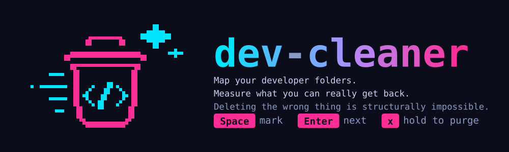
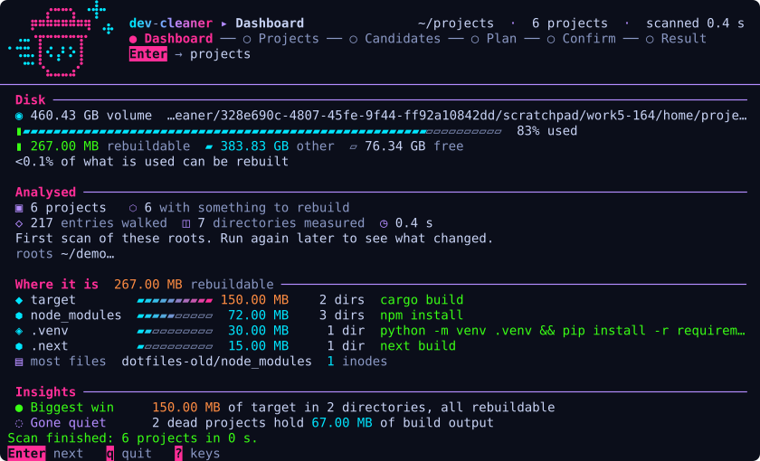
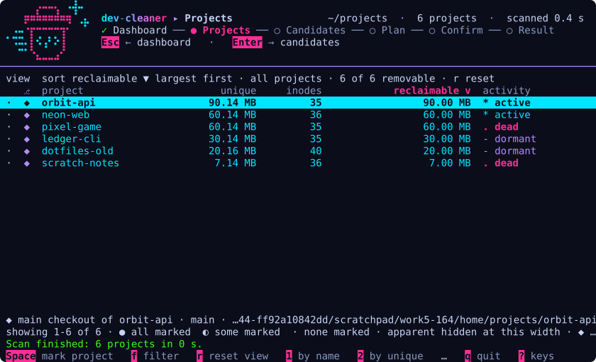
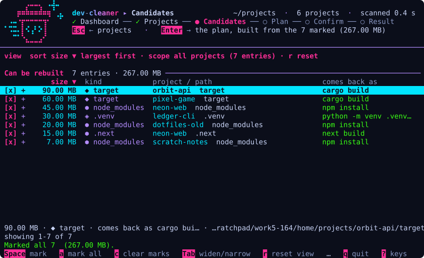
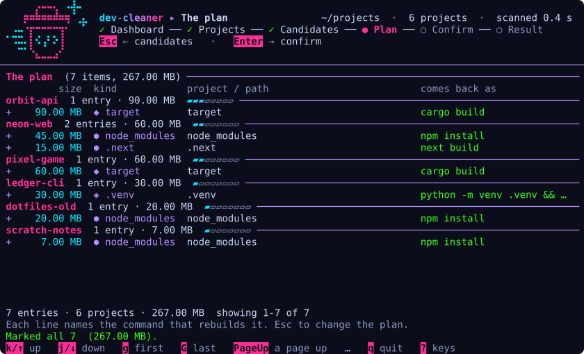
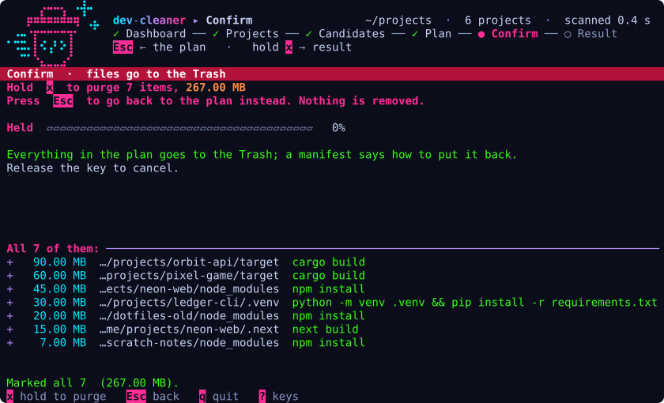
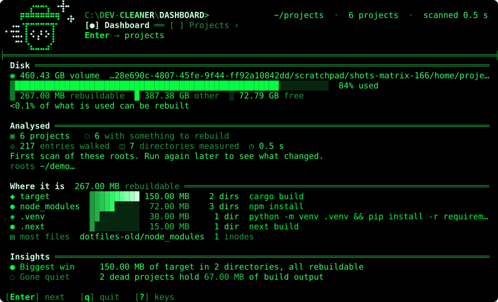

<p align="center">
  
</p>

<p align="center">
  <a href="https://github.com/CarlosDanielDev/dev-cleaner/actions/workflows/ci.yml"></a>
  <a href="LICENSE"></a>
  
  
  <a href="CHANGELOG.md"></a>
</p>

A terminal UI that maps your developer project folders, classifies what each
directory is, measures what you can **actually** get back, and makes deleting
the wrong thing structurally impossible.

```
scanned 6 projects, 217 entries in 0.00 s
  projects       6
  actual/unique  0.26 GB

build artifacts
  target            0.15 GB        2 files   cargo build
  node_modules      0.07 GB        3 files   npm install
  .venv             0.03 GB        1 files   python -m venv .venv && pip install -r requirements.txt
  .next             0.01 GB        1 files   next build
  total             0.26 GB  reclaimable
```

## Why

Build artifacts, dependency trees and toolchain caches regenerate on every
build and never announce themselves. The disk fills, the machine lags, and
there is no obvious culprit. Size-ranking tools show *what is big*. None of
them answer the question that actually blocks you: **which of these can I
delete without losing work?**

dev-cleaner answers it, and refuses to let you get it wrong.

- **Nothing is deletable unless the tool can name the exact command that
  brings it back.** Every candidate says what brings it back:
  `cargo build`, `npm install`, `git clone`.
- **Measured bytes are unique bytes.** Every directory is sized with each inode
  counted once, so hardlinked package stores and sparse files cannot inflate
  the number you are promised.
- **Work that exists nowhere else is never offered.** Untracked files, stashes
  and dirty worktrees block a path, and say why.
- **Deleting is a held key on one screen, and it goes to the Trash.**

## Install

dev-cleaner is built from source. There are no published binaries or packages
yet; they are on the [roadmap](#roadmap).

You need macOS and a Rust toolchain that supports edition 2024 (Rust 1.85 or
newer). SQLite is compiled in and git state is read straight from `.git`, so
there is nothing else to install.

```sh
git clone https://github.com/CarlosDanielDev/dev-cleaner.git
cd dev-cleaner
cargo install --path .
```

That puts `dev-cleaner` in `~/.cargo/bin`. To try it without installing, use
`cargo run --release -- <command>` from the clone.

## Quick start

```sh
dev-cleaner tui ~/projects     # scan, then browse. Nothing is removed until you hold a key.
dev-cleaner scan ~/projects    # the same scan as a report. Always read-only.
dev-cleaner purge              # dry run: the plan, what is blocked, and the phrase
```

Leave out the roots and the configured ones are used (`~/projects` until you
say otherwise, see [Configuration](#configuration)).

| Command | What it does |
| --- | --- |
| `dev-cleaner tui [roots...]` | Scan, then browse the result full-screen |
| `dev-cleaner scan [roots...]` | Walk, classify, report and record. Always read-only |
| `dev-cleaner duplicates [roots...]` | The same package installed in many projects |
| `dev-cleaner shared-store [roots...]` | Estimate what a shared package store would recover |
| `dev-cleaner purge` | The plan, what is blocked, and the confirmation phrase. A dry run |
| `dev-cleaner purge --execute --confirm "<phrase>"` | Carry the plan out, to the Trash |

Every command except `purge --execute` is read-only.

## The screens

`dev-cleaner tui` opens six screens in a fixed flow. A stepper in the header
shows where you are: `✓` behind you, `●` here, `○` ahead.

**Dashboard**: the disk as it stands, what is rebuildable, and what moved since
the last scan.



**Projects**: every project, sortable by every column, filterable, with marks.



**Candidates**: what is offered, what is blocked and why, and the command that
brings each one back.



**The plan**: exactly what will be carried out, grouped by project.



**Confirm**: the one screen a deletion can start from, and only by holding a key.



**Result**: what moved, where it went, and what failed. From there `Enter`
loops back to a fresh dashboard.

The screenshots are real frames of the program, run against a synthetic tree in
an isolated `HOME`, and regenerated by [`docs/tools/screenshots.py`](docs/tools/screenshots.py).
It needs a terminal at least 80 by 24; the logo joins the header from 90 by 28.

### Keys

| Keys | Where | What they do |
| --- | --- | --- |
| `Enter` | Dashboard, Projects, Candidates, Plan | forward |
| `Esc` | Projects, Candidates, Plan, Confirm | back |
| `Enter` `Esc` | Result | back to a fresh dashboard, by scanning again; asks first when the last scan was slow (see [Configuration](#configuration)) |
| `↑` `k` `↓` `j` | Projects, Candidates, Plan, Result | move |
| `g` `G` | Projects, Candidates, Plan, Result | first, last |
| `PageUp` `PageDown` | Projects, Candidates, Plan, Result | a page at a time |
| `Space` | Projects, Candidates | mark: a project's removable entries, or one entry |
| `f` | Projects | next filter: all, removable, marked, quiet |
| `r` | Projects, Candidates | reset sort, filter and scope |
| `1` `2` `3` `4` `5` `6` `7` | Projects | sort by column, again to reverse |
| `1` `2` `3` | Candidates | order by path, size or kind |
| `a` `c` | Candidates | mark all, clear marks |
| `Tab` | Candidates | widen to every project, or narrow back |
| `x` | Confirm | hold to purge. The only key that deletes |
| `q` `?` | Everywhere | quit, show the keys |
| `T` | Everywhere | switch to the next theme and remember it. On the key bar where there is room (first to go), in `?`, and always hinted in the header (`T theme: neon`). Refused on Confirm and while a purge runs |

Sorting is on the digits rather than on letters on purpose: the mnemonic for
"size" is `s`, which sits next to the key that purges, and a table is sorted far
more often than a plan is confirmed. `tests/readme_claims.rs` checks this table
against the keymap, so it cannot drift.

## How it stays safe

Safety is proven, not assumed, and the proof is enforced by the compiler:

```rust
impl Plan<Draft>     { fn review(self)               -> Plan<Reviewed>                       }
impl Plan<Reviewed>  { fn confirm(self, typed: &str) -> Result<Plan<Confirmed>, Plan<Reviewed>> }
fn execute(plan: Plan<Confirmed>, remover: &dyn Remover) -> Manifest
```

`execute` takes a `Plan<Confirmed>`, and that is the only way to make one.
Deleting without review and explicit confirmation does not compile.

On top of the types:

- **Hard guards you cannot switch off.** A path outside every configured root,
  a symlink that leaves one, a path on your denylist, a repository with
  uncommitted changes, untracked files or stashed work: all blocked, with the
  reason on screen. No key, flag or setting overrides one.
- **Hold, don't press.** The purge key must be held for 1.5 seconds, on the
  confirm screen only. No other key deletes, none is global, and none is a key a
  hand reaches for by accident (`Enter`, `Delete`, `Backspace`). A test asserts
  this over the whole keymap.
- **The CLI asks twice.** `purge` is a dry run. `--execute` alone is refused: it
  needs `--confirm` with a phrase that describes that exact plan, which cannot
  be known without having read it.
- **Trash, not delete.** No production code path in `src/` removes a directory
  except through the macOS Trash, and every removal writes a restore manifest
  naming what moved and where.
- **A prediction is never reported as a result.** The one estimated figure the
  tool produces, `shared-store`, is labelled as an estimate and kept off every
  screen that shows a measured reclaimable total.

The protected code is [`src/safety`](src/safety). See [SECURITY.md](SECURITY.md)
for what counts as a vulnerability here.

## Using it

### `scan`

Walks, classifies and measures, **ignoring `.gitignore`**: the reclaimable
bytes are exactly what `.gitignore` hides. Every scan is recorded and compared
against the last scan of the same roots, so a narrower scan never reports the
directories outside it as deleted.

```
activity
  active         2
  dormant        2
  dead           2  (idle >180d, every commit on a remote)
      1 of 2 clear every guard
      1 blocked: Untracked source files here exist nowhere else.

since the previous scan
  nothing changed
```

A project is *active* within 30 days, *dormant* up to 180, and *dead* beyond
that when every commit is on a remote, so `git clone` provably restores it.

### `purge`

A dry run by default: the flag is not something you have to remember. It prints
the plan, everything it refused and why, and the confirmation phrase.

```
Plan: 7 item(s), 0.26 GB
      0.09 GB  ~/projects/orbit-api/target
      0.06 GB  ~/projects/pixel-game/target
      0.04 GB  ~/projects/neon-web/node_modules
  ...

This was a dry run. Nothing has been touched.
To carry it out:
  dev-cleaner purge --execute --confirm "purge 7 items 279969792 bytes"
```

(Paths shortened here; the command prints them in full.) The phrase describes
that exact plan: a flag can be recalled from shell history, a phrase cannot.

### `duplicates` and `shared-store`

`duplicates` is a report, not a plan. What it names is already inside the
artifact directories `scan` counts, so those bytes are not additional space.
The number it gives is what collapsing every copy into one would free.

`shared-store` estimates what a shared, content-addressed store would recover
across the projects that still copy packages into themselves. It says it is an
estimate wherever it prints, names the projects it could not decide about, and
prints the migration command without running it.

## The look

The interface has an identity, and this page borrows it. Neon on a near-black
indigo ground, in the spirit of 1980s Neo-Tokyo: colour directs the eye, so the
thing to read first is the brightest, what can be skipped is the dimmest,
danger is hot and safe is calm. One role is one colour on every screen, through
[`src/tui/palette.rs`](src/tui/palette.rs).

| Role | Colour | Carries |
| --- | --- | --- |
| Ground | `#0b0e1a` | the background the interface paints for itself |
| Magenta, bold | `#ff2e97` | titles, the sorted column, a marked row, every key cap |
| Cyan | `#00e5ff` | gauges that measure, names, the screen a key leads to |
| Acid green | `#39ff14` | how a path comes back; a change that was made |
| Violet | `#b48cff` | structure: separators, arrows, tier glyphs |
| Amber | `#ffb000` | held back, stopped short; a key that was refused |
| Red | `#ff3860` | the one screen that removes anything |

The logo is the pixel-art trash can with a `</>` on it. The README banner is
generated from the same grid the interface draws (`MASTER` in
[`src/tui/logo.rs`](src/tui/logo.rs)) by [`docs/tools/logo_svg.py`](docs/tools/logo_svg.py), and a test
asserts the two match cell for cell.

The look is chosen once, at startup, from the environment:

- `COLORTERM=truecolor` or `24bit`: the theme above in RGB, on a ground of its
  own. Every text colour is tested at 4.5:1 or better against it.
- Any other terminal (256 or 16 colours): the same roles in the named ANSI
  colours, over your profile's own background.
- `NO_COLOR` set to anything but empty: no colour escape at all. Every meaning
  is still carried by a glyph, a word or a weight: `!` and the word `BLOCKED`
  for a hold, `✓ SAFE` for a clean run, a reversed bold band for the screen that
  removes things.

Colour is never the only carrier, and red and green are never the only
difference between two states. What is described above is the `neon` theme, the
first of the [themes](#themes). There is no user theme file.

## Themes

Two themes ship. Each is drawn in the three colour modes above.

| Theme | What it is |
| --- | --- |
| `neon` | neon on indigo: the look dev-cleaner was born in (the default) |
| `matrix` | MS-DOS meets the Matrix: phosphor green on black, double rules, digital rain |



`matrix` is phosphor green on true black, drawn like a 1990s DOS program that has
seen the movie: double-line rules, shaded block bars (`█▒░`), bracketed key caps
(`[Enter]`), a stepper written `[✓] [●] [ ]`, the highlighted row as the DOS
inverse bar, and a title that is a prompt, `C:\DEV-CLEANER\DASHBOARD>`, with a
block cursor that blinks. While a scan runs, a little digital rain falls in the
empty cells beside its progress block. Green never carries a meaning alone: a
hold is CRT amber and the word `BLOCKED`, danger is hot red and only on the
screen that removes things.

**Choosing.** The first of these that says something wins:

1. `dev-cleaner tui --theme matrix` (also on `scan`)
2. the `DEV_CLEANER_THEME` environment variable
3. the theme you last picked with `T` in the interface
4. `theme = "matrix"` in the [configuration](#configuration)
5. `neon`

A name there is not (`--theme bogus`) is an error that lists the valid ones. A
bad value anywhere else is ignored with one line saying so when the interface
opens, and the next source answers.

**Switching.** `T` shows the next theme on whatever screen you are on, at once,
and saves it (`Theme: matrix (saved)`). It is listed under `?`. It is refused on
the confirm screen and while a purge runs, where nothing may be decided by a
stray key: `The theme cannot change during a purge.` A choice that cannot be
saved (a read-only state directory) still switches for the session and says so.

**Where it is kept.** One word in `~/.local/state/dev-cleaner/theme`, next to
the purge records, written whole and renamed into place. Your hand-edited
config is never rewritten.

**Also everywhere else.** `scan`'s progress line and `purge`'s plan are drawn in
the same theme when they print to a terminal. `NO_COLOR` still wins: no colour
at all, and the matrix keeps its glyphs. `DEV_CLEANER_REDUCED_MOTION=1` keeps
the cursor solid and turns the rain off.

The screenshot is made by [`docs/tools/screenshots.py`](docs/tools/screenshots.py)
with `--theme matrix`.

## Configuration

`~/.config/dev-cleaner/config.toml`. A missing file yields working defaults: a
first run should need no setup.

```toml
# Directories to scan for projects.
roots = ["~/projects"]

# Ecosystem cache registries to include, by name.
caches = ["npm", "cargo", "go", "xcode", "gradle", "cocoapods", "pnpm"]

# Paths that must never be offered, whatever else concludes.
denylist = ["~/projects/client-work"]

# The theme to open in when nothing above it in the list under "Themes" says.
theme = "neon"

# Ask before a scan from the interface that the last one says is slow, or that
# has no record to say it by. On by default; `dev-cleaner scan` never asks.
confirm_rescan = true

# What "slow" is: seconds the last complete scan of the same roots took.
confirm_rescan_after_secs = 10
```

**Scanning again.** Leaving a result, and `R` after a cancelled scan, read every
entry under the roots again. When the newest complete scan of the same roots
took ten seconds or more, or there is none on record, a box titled `Scan again?`
says how many entries it read and how long it took *last time* (a measured
fact, never a prediction) and waits: `Enter` scans, `Esc` stays, every other key
is ignored. An `Enter` that comes right after another key, or is held down, does
not answer it. Under the threshold the scan simply starts. `confirm_rescan =
false` turns the box off.

The denylist is the outermost safety boundary: both sides are canonicalised
before comparison, so `a/../denied/x` is recognised as the denied location it
actually resolves to.

| What | Path |
| --- | --- |
| Configuration | `~/.config/dev-cleaner/config.toml` |
| Scan history | `~/.local/state/dev-cleaner/history.sqlite3` |
| Purge records | `~/.local/state/dev-cleaner/manifests/` |
| Theme picked with `T` | `~/.local/state/dev-cleaner/theme` |

State is deliberately outside every scanned root and every registered cache: a
record the tool could later offer to delete is not a record.

## How it works

| Path | What lives there |
| --- | --- |
| `src/scan/` | Walking and measuring. `Usage` is the only place bytes are totalled. |
| `src/classify/` | What a directory is, which ecosystem owns it, whether its project is alive. |
| `src/safety/` | Tiers, guards, and the typestate `Plan`. |
| `src/purge/` | Trash-based execution and the restore manifest. |
| `src/store/` | Snapshots and trends, in SQLite. |
| `src/tui/` | Screens, routing, the keymap and the palette. |
| `src/duplicates.rs`, `src/shared_store.rs` | Cross-project package reporting. |

Built on `ratatui`, `jwalk`, `rusqlite`, `trash` and `clap`. Git state is read
straight from `.git`, two files at a time, rather than through a library or a
subprocess. The decisions worth knowing before changing anything are in
[`docs/SESSION-HANDOFF.md`](docs/SESSION-HANDOFF.md) and the original
[design spec](docs/superpowers/specs/2026-08-19-dev-cleaner-design.md).

## Performance

Measured in [#161](https://github.com/CarlosDanielDev/dev-cleaner/pull/161), on
a synthetic tree of 959,245 inodes (869,650 files, 3.4 GB) across 300 projects,
a release build with a warm cache, on macOS arm64. A plain `scan` went from
89.3 s to between 13.8 and 17.4 s, and the interface's load phase from 140.3 s
to 16.7 s. What remains is mostly the directory walk. Your tree is not that
tree: treat it as an order of magnitude, not a promise.

Against reality rather than only against tests, sizing is validated against
`du` on a real corpus: on the author's machine a manual pass following these
rules recovered 41.8 GB with no data loss ([the record](docs/evidence/purge-manifest-2026-08-19.md)).

## Roadmap

Delivery is what is left. All three original milestones are closed and the
interface work is merged; what is open:

- **Packaging.** Tagged releases with macOS binaries attached, then Homebrew
  and the other package managers: [#61](https://github.com/CarlosDanielDev/dev-cleaner/issues/61).
- **CI hardening.** Build the binary on every run and pin what the gate may
  assume: [#62](https://github.com/CarlosDanielDev/dev-cleaner/issues/62).
- **Scan lifecycle.** Say what the scan is doing after the walk, and ask before
  an expensive re-scan: [#115](https://github.com/CarlosDanielDev/dev-cleaner/issues/115),
  [#162](https://github.com/CarlosDanielDev/dev-cleaner/issues/162).

## Contributing, security, license

- Work is issue-first, test-first and gated locally: read [CONTRIBUTING.md](CONTRIBUTING.md).
- Found a way to make the tool remove something it should not? Report it
  privately: [SECURITY.md](SECURITY.md).
- What changed and when: [CHANGELOG.md](CHANGELOG.md).
- [MIT](LICENSE), Copyright (c) 2026 Carlos Daniel.
